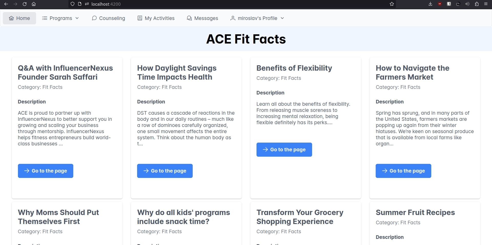
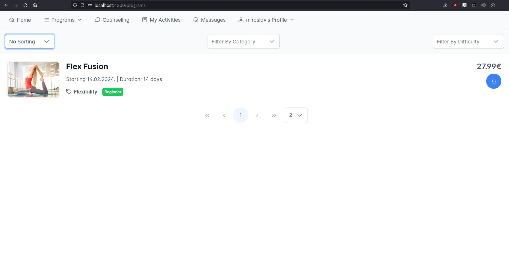
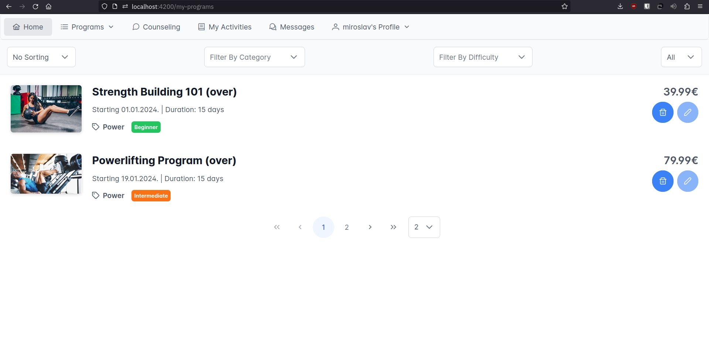
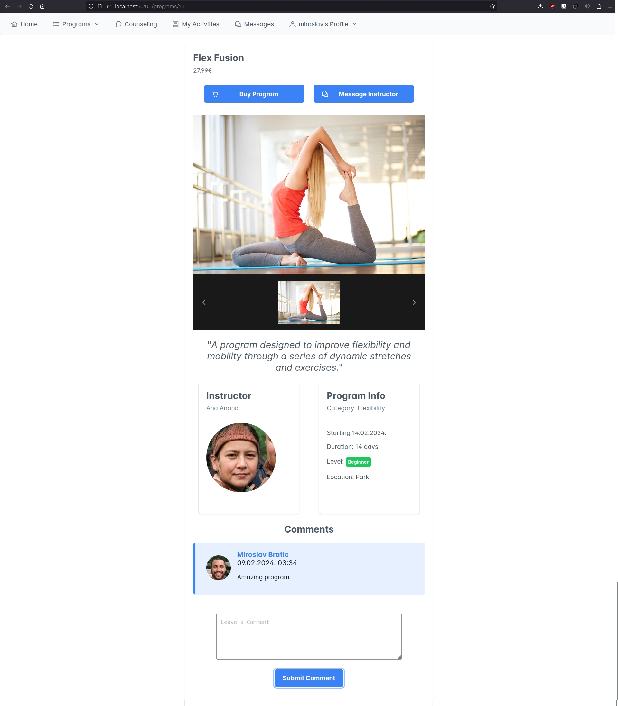
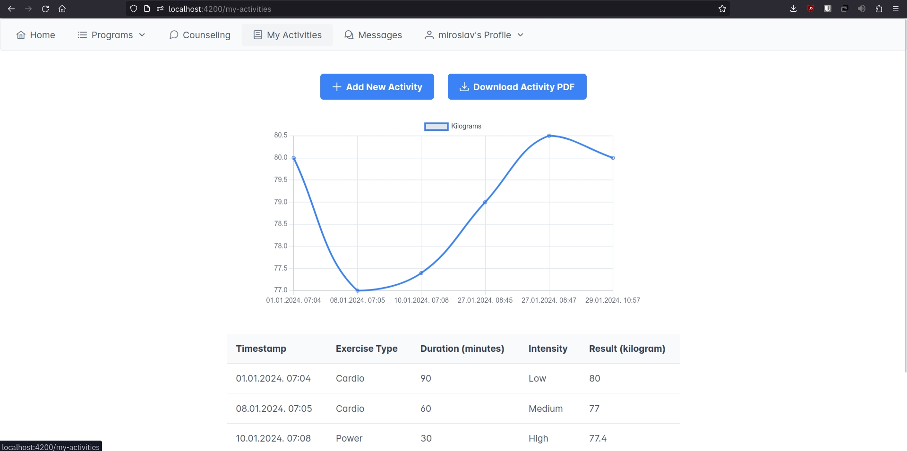
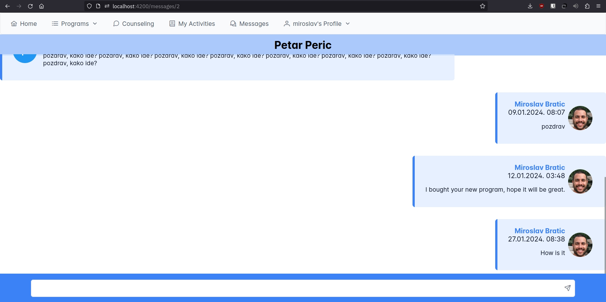
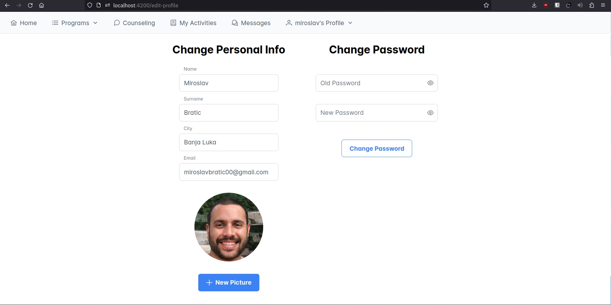
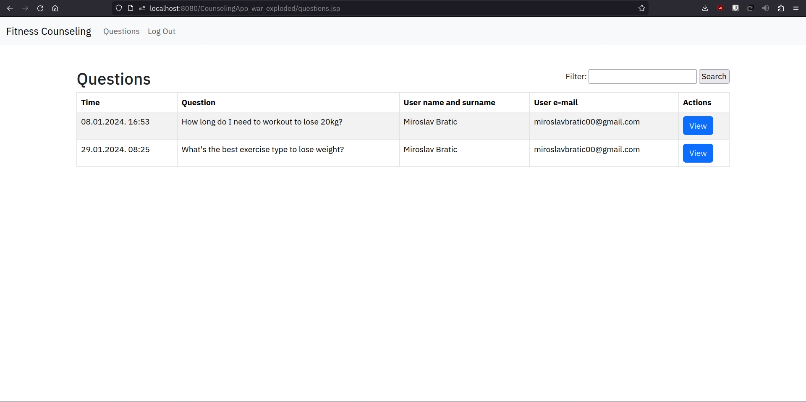
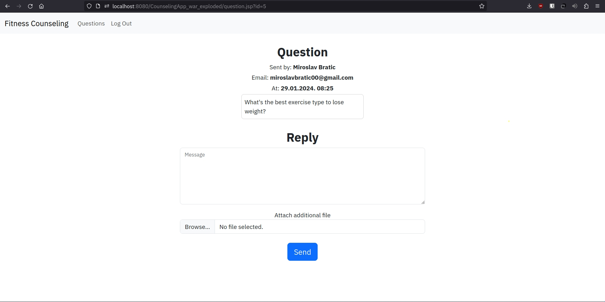
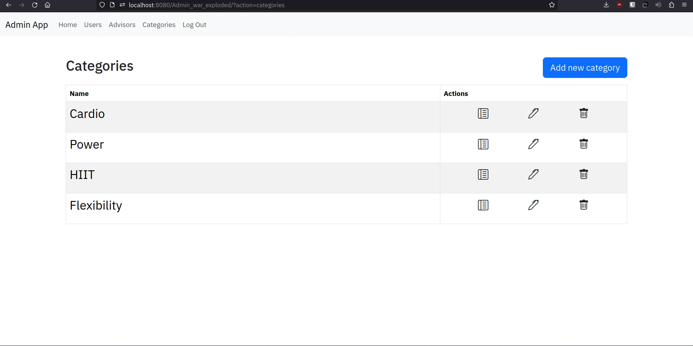

# eFitness

## Introduction

A web project consisted of four applications that is used for creating, buying and participating fitness programs, tracking your progress, recommending training programs.
This web project comprises four applications designed for creating, purchasing, and participating in fitness programs, tracking progress, and receiving recommendations for training programs.

## Warning
Please note that security was not prioritized in this project. If you're interested in viewing a secure web application, check out the <a href="https://github.com/qu4lizz/forum">Forum application</a>.

## Technologies

<ul>
    <li>Angular (JS/TS)</li>
    <li>Java Spring Boot</li>
    <li>Java Servlets</li>
    <li>JSP (Java Server Pages)</li>
    <li>PostgreSQL</li>
</ul>

## Applications Descriptions

### Client (Angular)

    A responsive Angular application serves as the front-end, utilizing PrimeNG as the UI library. Version 17 of Angular is employed.

    On the home screen, it displays fitness facts from an RSS feed, along with the top 10 daily exercises. Users can browse all available programs, filter them by category and difficulty, and sort them by name, price, and date. The application also facilitates the creation of new programs. Users can view programs they've created or participated in. Additionally, they can send questions to fitness counselors.

    Users can exchange messages, track their progress by adding results after each exercise, view their progress on graphs and tables, download progress as PDF, and modify their information and password.

### Server (Spring Boot)

    The backend of the application provides resources to the Client, offering functionalities such as REST services, email sending, RSS consuming, scheduled tasks, logging, and authentication (register, login, mail confirmation).

### Counseling App (JSP)

    This application is used by fitness counselors to respond to user questions. In addition to messages, counselors can attach files that will be sent to the user via email.

### Admin App (JSP M2 and Servlets)

    Admins have access to application logs and functionalities for adding, deleting, and editing users, advisors, and categories. Attributes can be added to each category.

